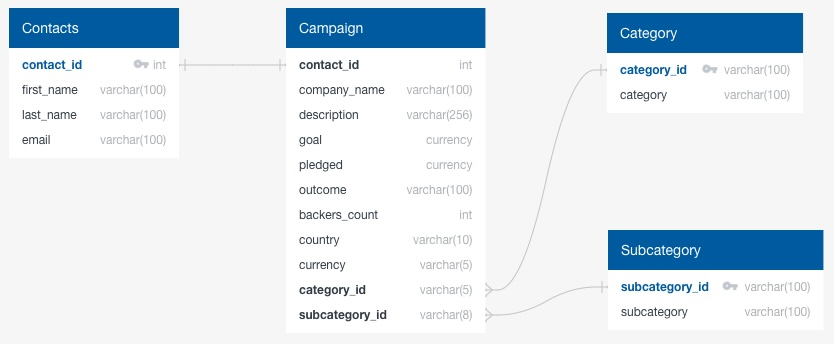

# ETL_Mini_Project_Crowdfunding

This project is a collaboration between Andrew Lane and Mark Phillips and is designed to demonstrate the Extract, Transform and Load (ETL) process. 

In this project, data is extracted from Excel files, cleaned and transformed in Pandas and loaded into a SQL database.

## Files
- ETL_Mini_Project_MPhillips_ALane.ipynb
- Resources/
  - campaign.csv
  - category.csv
  - contacts.csv
  - contacts.xlsx
  - crowdfunding_db_schema.sql
  - crowdfunding.xlsx
  - ERD_text.rtf
  - ERD.jpg
  - subcategory.csv

## Highlights

- Data was imported from Excel files
- Data fields with multiple data popints (first and last names or category/subcategory) were seperated into their own fields
- Date and time information was formated for ease of reading
- After general cleanup, files were exported into csv format for importing into SQL

## Setup
- Have environment setup to run the jupyter file (*.ipynb)
- load schema into SQL environment (postgreSQL was used)
- import the *.csv files into the tables with the same names 
  - (import campaign.csv last due to foreign keys)

## Acknowledgements
 - This project was created as part of the EdX Data Analytics Bootcamp
 - File structure and data is provided by EdX
 - The language model AI Xpert was used for troubleshooting during the project

## Authors

Andrew Lane, 2024
- [@andrewplane](https://github.com/andrewplane)

Mark Phillips, 2024
- [@MarkP3592](https://github.com/markp3592)